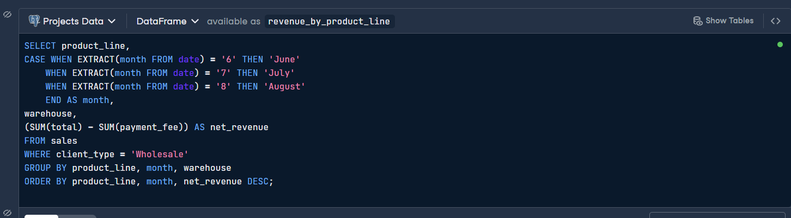
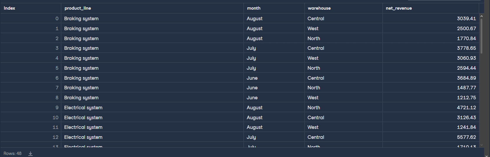

# 🏍 Motorcycle Wholesale Revenue Analysis (SQL)

## 📌 Project Overview

This project analyses wholesale motorcycle part sales data to calculate **net revenue by product line, warehouse, and month**.

The objective was to provide board-level visibility into revenue performance across product categories and operational warehouses.

---

## 🧠 Business Problem

The company operates three warehouses (North, Central, West) and processes both Retail and Wholesale transactions.

The board requested:

- Net wholesale revenue by product line  
- Monthly revenue trends (June–August 2021)  
- Warehouse-level performance comparison  

Only **Wholesale** transactions were included in the final analysis.

---

## 🗂 Dataset Structure

The dataset includes the following key fields:

- `order_number`
- `date`
- `warehouse`
- `client_type`
- `product_line`
- `quantity`
- `unit_price`
- `total`
- `payment`
- `payment_fee`

Net revenue was calculated as:

```
Net Revenue = SUM(total) - SUM(payment_fee)
```

---

## 🧮 SQL Approach

The analysis involved:

- Filtering Wholesale transactions
- Extracting month from the date field
- Aggregating revenue by product_line, month, and warehouse
- Calculating net revenue after payment fees
- Sorting results for executive-level reporting

---

## 💻 SQL Query

```sql
SELECT product_line,
CASE 
    WHEN EXTRACT(month FROM date) = '6' THEN 'June'
    WHEN EXTRACT(month FROM date) = '7' THEN 'July'
    WHEN EXTRACT(month FROM date) = '8' THEN 'August'	
END AS month,
warehouse,
(SUM(total) - SUM(payment_fee)) AS net_revenue
FROM sales
WHERE client_type = 'Wholesale'
GROUP BY product_line, month, warehouse
ORDER BY product_line, month, net_revenue DESC;
```

Full query available in:

```
/sql/query.sql
```

---

## 📊 Sample Output





*Sample output shown for demonstration purposes.*

---

## 🔎 Key Insights

- Certain product lines consistently generated higher net wholesale revenue across all warehouses.
- Revenue varied month-to-month, indicating possible seasonal or demand-driven effects.
- Warehouse segmentation revealed performance concentration in specific operational locations.

This structured output supports strategic decisions regarding product prioritisation and inventory allocation.

---

## 🛠 Skills Demonstrated

- SQL aggregation and grouping  
- Conditional logic using CASE statements  
- Financial-style revenue modelling  
- Data filtering and transformation  
- Business-oriented analytical reporting  

---

## 📁 Repository Structure

```
motorcycle-revenue-analysis/
│
├── data/
│   └── dataset.csv
│   └── dataset_cleaned.csv
├── sql/
│   └── query.sql
├── images/
│   ├── sql_query.png
│   └── results_table.png
└── README.md
```

---

## 🚀 Outcome

This project demonstrates the ability to translate a business question into structured SQL analysis and deliver executive-ready revenue insights.
